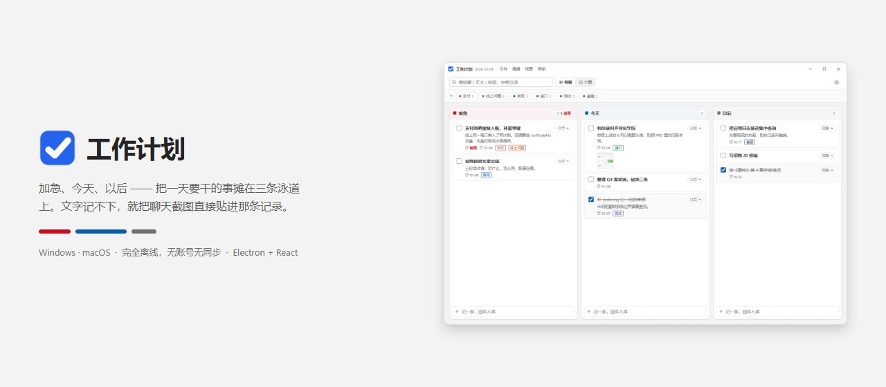

<p align="center">
  
</p>

<p align="center">
  <a href="https://github.com/gebizhangdaye/work-plan/releases/latest"></a>
  <a href="https://github.com/gebizhangdaye/work-plan/releases/latest/download/workplan-win-x64.exe"></a>
  <a href="LICENSE"></a>
  
  
  <a href="https://gebizhangdaye.github.io/work-plan/"></a>
</p>

# 工作计划（Windows / macOS 桌面版）

单人本机使用的工作计划看板：加急 / 今天 / 以后三档泳道，可勾选完成、写文字记录、直接贴聊天截图。纯本地离线，无账号、无同步、无网络请求。

**下载免安装版**：[workplan-win-x64.exe](https://github.com/gebizhangdaye/work-plan/releases/latest/download/workplan-win-x64.exe)（约 97 MB，Win10 / 11 x64，双击即用）· [Releases](https://github.com/gebizhangdaye/work-plan/releases) · [使用教程](https://gebizhangdaye.github.io/work-plan/docs.html) · 官网 [gebizhangdaye.github.io/work-plan](https://gebizhangdaye.github.io/work-plan/)

## 跑起来

```powershell
npm install          # 已配 npmmirror；缺 electron 二进制时 postinstall 自动走镜像补
npm run dev          # 开发（带热更新）
npm run check        # typecheck + lint + vitest + 三段构建
npm run dist         # 产出 release\workplan-win-x64.exe（免安装 portable）
```

```bash
# macOS 包只能在 Mac 上出：.dmg 要 hdiutil、签名要 codesign，这两样 Windows 上都没有
npm ci && npm run icons && node scripts/probe-mac-assets.mjs && node scripts/probe-builder-config.mjs && npm run check
npm run dist:mac:arm64   # Apple Silicon；Intel 用 dist:mac:x64，两个都要就跑 dist:mac
```

零原生模块（存储是 Electron 内置 `node:sqlite`），所以换平台不需要 node-gyp、不需要 `@electron/rebuild`。`icon.icns` 与 `trayTemplate*.png` 由 `npm run icons` 现生成，不走 electron-builder 那套要从 GitHub 下载的图标 toolset。macOS 产物是 ad-hoc 签名、**未公证**，首次打开会被 Gatekeeper 拦，放行办法写在 `docs/manual-acceptance.md` §14。

双击 `release\workplan-win-x64.exe` 即可用，不需要管理员权限。未签名，首次运行 Windows 可能弹 SmartScreen「仍要运行」。

## 数据在哪

固定在 appData 下的 `work-plan`：Windows 是 `%APPDATA%\work-plan\`，macOS 是 `~/Library/Application Support/work-plan/`（跟 exe / .app 放哪无关，换机器重下不丢数据）：

```
workplan.db            SQLite（node:sqlite 内置驱动，WAL）
attachments\YYYY\MM\*.png   截图，库里只存相对路径
backups\workplan-<时间戳>.db  每次启动自动备份，保留最近 5 份
```

## 怎么用

- **记一条**：任一列底部输入框，写完回车即入库。
- **勾选完成**：卡片左侧复选框；完成项沉到本列底部，按完成时间倒序。
- **改档位**：拖动卡片跨列；或点卡片右下角 `→今天` 循环切档。
- **列内排序**：同列内上下拖动。
- **贴聊天截图**：微信/QQ 截图后，点开卡片 → 在「记录」框里 `Ctrl+V`。剪贴板是图就落盘成附件；是文字就照常输入，不用切换模式。
- **拖图片文件**：把图片拖到「记录」框，原文件不被移动或改名。
- **裁一块**：点缩略图看大图 → 「裁剪这一块」→ 框选 → 「存为新截图」（原图保留）。
- **搜索**：操作栏搜索框，空格分词，命中范围是标题/正文/标签名。
- **标签**：卡片详情里输入标签名回车；操作栏第二行的 chips 多点为 AND 过滤。
- **导出**：齿轮 → 设置弹窗的「导出」分区，两项：Markdown 文档 / CSV 表格，csv 带 BOM，Excel 直接开。
- **逾期**：`计划日 < 今天 且未完成` 的卡片标题上带红色「逾期」标记，并在本列排最前；计划日永远不会把条目藏起来。
- **自定义标题栏**：主窗也是无边框，顶上一条 40px 标题栏：logo + 应用名 + 今天 + **文件 / 编辑 / 视图 / 帮助**菜单，右侧是最小化 / 最大化还原 / 关闭到托盘；下面一行操作栏只放 检索、看板·小窗分段、一个齿轮。
  - 菜单条是渲染层自己实现的（`renderer/titlebar/MenuBar.tsx` + `menus.ts`），点字打开、打开后横向移入即切换、Esc / 点外面 / 窗口失焦关闭；每一项的动作通过 `workplan/menu/action` 交给主进程，**按发起窗口执行**，所以主窗和小窗共用一份菜单
  - **Windows**：原生菜单整个撤掉（`Menu.setApplicationMenu(null)`）：无边框时它本来就不显示，留着等于同一套菜单两份定义会各自漂移。撤掉后 `Ctrl+C/V/X/Z/A` 交回 Blink 在输入框里的默认行为，应用级快捷键（`Ctrl+M` 收托盘、`Ctrl+Q` 退出、`Ctrl+R`/`F5` 重载、`Ctrl+0`/`Ctrl+=`/`Ctrl+-` 缩放、`Ctrl+Shift+I`/`F12` 开发者工具、`F11` 全屏）由标题栏菜单自己监听
  - **macOS**：撤不掉——那是 `⌘Q`/`⌘H`/`⌘M`、窗口菜单和「没选区时剪切置灰」的唯一入口，所以 `main/boot/nativeMenu.ts` 按平台分支，mac 上建一份原生菜单栏（标题栏那条照旧留着，两者不重叠）。这一份全是「叶子 role + 显式中文 label + 显式 accelerator」，不用 `appMenu`/`editMenu` 这种整块 role，否则会连默认英文项一起进来；`src/infrastructure/__tests__/darwinMenuTemplate.test.ts` 就在守这条。快捷键此时让给原生菜单，渲染层整个不接，免得同一动作双触发
  - 两边的快捷键标签与 mac accelerator 同源于 `src/shared/menuShortcuts.ts`（标题栏 `<kbd>` 显示的和原生菜单注册的就是同一串），`Ctrl+…` / `⌘…` 按 `isMac` 取；`isMac` 由 preload 同步暴露，不走 IPC，避免首屏按错左内边距闪一下
  - 「关闭」是收进托盘不是退出；要真退出走托盘菜单、`Ctrl+Q`（mac 是 `⌘Q`）或设置弹窗「关于 → 退出工作计划」。mac 上红钮发的也是同一个 `close` 事件，所以直接被拦成收进托盘，Dock 图标点下去靠 `app.on('activate')` 唤回
- **设置弹窗**：齿轮开一个居中模态，左侧菜单分三区——导出 / 数据与运行 / 关于；`Esc` 或点遮罩关闭。标题栏「帮助 → 关于工作计划」直接跳到关于分区。
- **小窗置顶**：分段控件「小窗」打开一个**独立的无边框窗口**（默认 420×560、可拖边改大小、下限 300×320、Win11 圆角、置顶、不进任务栏），主窗同时隐藏。不复用主窗的原因：Electron 的 `frame` 只能在创建时决定，靠"缩小主窗口"做小窗永远甩不掉系统标题栏。
  - 默认**只有内容条**：标题栏、三档计数、搜索框、视图分段控件全收起；鼠标移入或焦点落在搜索框时才展开（`:hover` + `:focus-within`，不走 React 状态）
  - 可拖：只有**顶部 12px 那条静态把手**是 `-webkit-app-region: drag`。整窗挂 drag 会让系统吞掉 mousemove，`:hover` 只在指针压到 `no-drag` 元素那一刻才刷新，展开时机就飘在鼠标移动途中（真机 A/B 实测），看着就是抖动
  - 列表 `scrollbar-gutter: stable` 常留滚动条槽：工具层展开后可视高度少 120px，7~8 条时滚动条会中途冒出来把整行挤窄 15px（离屏实测 `deltaRowWidth: -15px`）
  - 小窗头部用的是**与大窗同一个分段控件**（看板 / 小窗，当前那项白底加粗），点「看板」回三列看板（主窗重新显示并自动重拉数据）；小窗里不再有单独的还原/最小化图标按钮，收进托盘走托盘图标或 `Ctrl+M`

## 技术形态

Electron 44.7.0（内置 Node 24.21.0 / SQLite 3.53.4）+ React 19 + TypeScript 6 + Vite 7 + electron-vite 5。
存储用 Electron 内置 `node:sqlite`，**零原生模块**：所以不需要 node-gyp、不需要 Visual Studio BuildTools、不需要 `@electron/rebuild`。

```
src/domain/           纯业务（泳道/排序/过滤/导出/命名），不 import electron 或 node 内置模块
src/infrastructure/   db、storage、media、ipc、window、tray、startup
src/main / src/preload / src/renderer
src/shared/           IPC 通道名与 WorkPlanApi 契约（三端共用）
```

版本是被实测出来的「可共存最新集」，不是 npm `latest`：`vite` 锁 7.3.7（electron-vite 5 的 peer 上界）、`typescript` 锁 6.0.3（typescript-eslint 8.71.1 要求 `<6.1.0`，TS 7 会让带类型的 lint 失效）。抬 Electron 大版本前必须重跑 `node_modules/electron/dist/electron.exe scripts/probe-node-sqlite.cjs`，确认 `node:sqlite` 仍然可用。

## 自检命令

```powershell
node node_modules/electron/dist/electron.exe scripts/probe-node-sqlite.cjs   # spike：node:sqlite + WAL + fts5
node node_modules/electron/dist/electron.exe scripts/probe-render.cjs        # 离屏验 app:// 出图与 --lang 落地
$env:WP_THEME="dark"; ./node_modules/electron/dist/electron.exe .            # 强制深色核对（仅开发态）
npm run check
node scripts/makeIcons.mjs                                                   # 重新生成托盘/应用图标（含 icns 与 mac 模板图）
node scripts/probe-mac-assets.mjs                                             # 核对 icon.icns 条目表 + trayTemplate 的 alpha 真的带软边
```

`probe-render.cjs` 用 `BARE=1` 开关做对照，实测结论：`protocol.handle('app://', …)` **不生效**（`` 是 0x0），必须传裸 scheme `protocol.handle('app', …)`（图 16x16 正常出、路径穿越仍被 404 拦）。

## 语言

界面、托盘、设置弹窗、文件对话框全部简体中文。语言在启动时钉死，不跟系统语言飘：
`app.commandLine.appendSwitch('lang', 'zh-CN')` 是 Electron 44 上唯一的杠杆（App 上没有 `setLocale`，只有 `getLocale`），它管 Chromium 原生控件：日期选择器、校验气泡；JS 侧日期一律显式传 `'zh-CN'` 或直接展示 ISO 字符串，不依赖运行时 locale。
菜单在 Windows 上全是渲染层自己画的（标题栏上的 文件/编辑/视图/帮助 与设置弹窗），原生菜单整个撤掉；macOS 上多出来那份系统菜单栏也是逐项写死中文 label（见「怎么用」那节），两边都不存在露英文项的可能；导出、数据与运行、关于收在设置弹窗的三个分区里。渲染层关掉 spellcheck，避免中文正文被英文拼写检查划线。

## 视觉系统：Fluent Design（Windows）

设计语言用 Fluent（Windows 原生那套），不自己发明风格。token 全在 `src/renderer/styles/app.css` 的 `:root`，组件里不写死数值。

| 维度 | 取值 |
|---|---|
| 中性层 | 浅：`#f3f3f3` 画布 / `#ffffff` 面 / `#fafafa` `#f0f0f0` 次级 / `#e1e1e1` 描边；文字 `#242424` `#5d5d5d` `#6f6f6f`。深：`#1b1b1b` / `#272727` / `#2d2d2d` / `#383838`；文字 `#f5f5f5` `#c7c7c7` `#a3a3a3` |
| 强调色 | 浅 `#0B5CAB`（配白字）；深 `#4DA3E8`（**配深色字** `#08131C`，亮强调上放白字过不了 AA） |
| 语义色 | 加急 `#C50F1F`（深 `#E0706E`）、勾选完成绿 `#0F7B3F`（深 `#6CCB8B`）；档位色只表达档位，不当装饰用 |
| 圆角 | 容器 8px、控件与卡片 4px、chip 胶囊。两套不混用 |
| 控件 | 高 32px、标题栏 40px + 操作栏 48px；Fluent 式 2px 下边框，hover 换底色，`:focus-visible` 才出 2px 焦点环 |
| 阴影 | 分层级 `--shadow-2/8/16`，不用纯黑大投影 |
| 字体 | `Segoe UI Variable Display/Text` + `Microsoft YaHei UI`（**Windows 的 Fluent 语言**）；字族串把 `-apple-system` 排在最前，Mac 上落到 SF + 苹方，`⌘ ⌥ ⌃ ⇧` 那几个符号靠 `ui-monospace` 排在 `Cascadia Mono` 前面才出得来。所有计数与时间用 `tabular-nums` |
| 动效 | 只动 `transform` / `opacity`，140ms，`prefers-reduced-motion` 下全关 |
| 明暗 | 跟随 `prefers-color-scheme`，无纯黑纯白；开发态 `WP_THEME=dark` 可强制 |

**功能区划分**
- 标题栏：logo + 应用名 + 日期（左）· 最小化/最大化/关闭（右）；下面操作栏一行：检索 · 视图分段 · 齿轮
- 视图模式用**分段控件**「看板 · 小窗」而不是裸图标：当前在哪个模式必须读得出来
- 列头带 6% 档位色底 + 计数胶囊（hover 有「N 条在办」提示），档位身份在板子里也认得出
- 详情抽屉分区：标题 / 元信息（计划日与档位并排两列，**档位可直接在抽屉里切**）/ 记录 / 标签 / 截图，底部固定操作条 + 本地时区的更新时间
- 小窗默认只有内容条，鼠标移入或焦点落在搜索框时才展开工具层（`:hover` + `:focus-within`，不走 React 状态）
- 时间显示一律走 `src/domain/workItem/timestampDisplay.ts`：库里存 ISO(UTC)，渲染时按本地时区格式化，直接 `slice` 字符串会差 8 小时

图标一律 **@phosphor-icons/react 2.1.10**（矢量，不用 emoji、不手搓 SVG 路径）：工具类 `size 13-16 weight regular`，强调处 `weight bold`，全项目同一家族。纯图标按钮必须带 `title` + `aria-label`。

## 仓库、发版与官网

安装包不进 git：单文件 97 MB，GitHub 对 >50 MB 报警、>100 MB 直接拒推，而且一旦提交就永久留在历史里，仓库再也瘦不回 2 MB。所以 `release/` 与 `site/download/` 都在 `.gitignore` 里，**二进制只放 Releases**。

产物名不带版本号（`electron-builder.yml` 里 `artifactName: workplan-win-${arch}.exe`），这样官网按钮可以用一条永久有效的直链：`https://github.com/gebizhangdaye/work-plan/releases/latest/download/workplan-win-x64.exe`。代价是文件名看不出版本 —— 版本在 Release 标题、应用内「关于」和 `product version` 里。带 `${version}` 的话每发一版都得回来改 HTML。

发版两步：

```powershell
npm run dist        # 产出 release\workplan-win-x64.exe
```

再在仓库的 Releases 页面建一个 tag（就是版本号本身，如 `0.1.1`，不加 `v` 前缀），把那个 exe 拖成附件。未签名，用户首跑仍会见到 SmartScreen，放行说明在 `docs/manual-acceptance.md`。

官网 `site/` 是纯静态、零构建，由 `.github/workflows/deploy-site.yml` 在推 `main` 时用官方 `upload-pages-artifact` / `deploy-pages` 发布到 GitHub Pages（公开仓库免费，且这条 CI 不跑 npm、不需要装依赖）。首次要在 Settings → Pages 把 Source 从默认改成 **GitHub Actions**，之后每次推 `main` 自动更新。

## 已知边界

- 开机自启：Windows 写当前用户的 Run 键，portable exe 换存放位置后旧路径失效，需重新勾一次；macOS 走登录项且 `setLoginItemSettings` 只认 `openAtLogin`（挂的就是当前这个 `.app`，挪动或改名后要重勾），未签名 ad-hoc 包不保证挂得上。
- macOS 上「红绿灯 + 自绘标题栏」的几何（`{x:12,y:13}` 与 `.titlebar-mac` 的 78px）是从 40px 条和 12px 内边距**推**出来的，没在真机上量过；整条 `-webkit-app-region: drag` 也有可能吃掉红绿灯的点击，这两条只能在 Mac 上验（`docs/manual-acceptance.md` §14）。
- 小窗/三列的切换状态不持久化：重启程序回到三列模式。小窗被拖成的尺寸同样不持久化，下次打开回到 420×560。
- 开发态控制台会打 Electron 的 `Insecure Content-Security-Policy` 安全提示：这是 dev 提示，打包后不出现。没有加 CSP meta 是**故意的**——`script-src 'self'` 会挡掉 Vite dev 注入的内联 fast-refresh 前导脚本，会弄坏 `npm run dev`；真要加 CSP 得区分 dev/prod 两套 HTML，属后续项。
- 渲染层已关闭拼写检查；`contextIsolation` + `sandbox` + `nodeIntegration: false` 都在。
- 搜索用内存分词匹配而不是 SQLite FTS5：FTS5 虽已编译进来，但默认 unicode61 分词器不切中文，对本项目的中文搜索反而更差；数据量千级时全量载入内存过滤更快也更准。
- 删除没有二次确认；误删靠 `backups\` 里的库快照 + 附件文件仍在磁盘上找回。
- 裁剪出的新图与来源图都保留，不做「删除原图」。

## 许可

MIT © [zt178](https://github.com/gebizhangdaye) —— 详见 [LICENSE](LICENSE)。

## 反馈

[GitHub Issues](https://github.com/gebizhangdaye/work-plan/issues)。数据全在本机 `%APPDATA%\work-plan`，带上这个目录复现最快 —— 但里面是你的真实待办和截图，传之前先自己过一眼。
